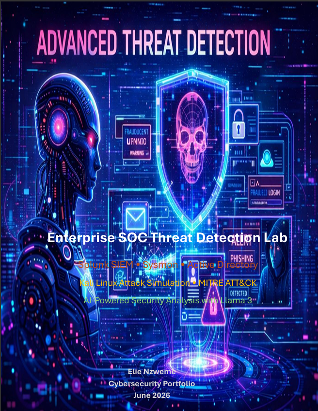
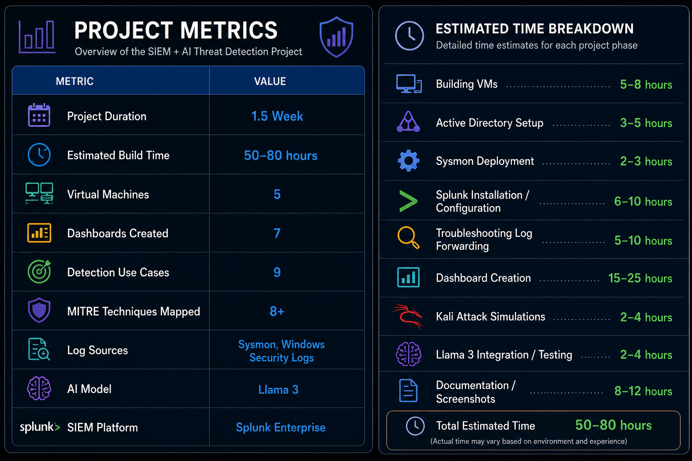

# Enterprise SOC Threat Detection Lab


---
# Cover Page

<p align="center">
  
</p>

---

# Overview

This project demonstrates the design, deployment, and operation of a Security Operations Center (SOC) lab built using VMware Workstation Pro, Splunk Enterprise, Sysmon, Active Directory, Kali Linux, and Llama 3 AI.

The environment simulates a real-world enterprise network where security telemetry is collected, centralized, analyzed, and investigated through custom Splunk dashboards and threat detection use cases aligned with the MITRE ATT&CK framework.

The project focuses on:

- Security Monitoring
- Detection Engineering
- Threat Hunting
- Active Directory Monitoring
- Incident Investigation
- AI-Assisted Security Analysis
- MITRE ATT&CK Mapping

---

# Project Metrics



| Metric | Value |
|----------|----------|
| Project Duration | 1.5 Weeks |
| Estimated Build Time | 50–80 Hours |
| Virtual Machines | 5 |
| Dashboards Created | 7 |
| Detection Use Cases | 9 |
| MITRE Techniques Mapped | 8+ |
| Log Sources | Sysmon & Windows Security Logs |
| SIEM Platform | Splunk Enterprise |
| AI Model | Llama 3 |

---

# Lab Architecture


## Security Monitoring Pipeline

Kali Linux → Windows Endpoints → Sysmon → Windows Event Logs → Splunk Universal Forwarder → Splunk Enterprise → Dashboards → Alerts → Llama 3 AI Analysis

---

# Environment Setup

## Virtual Machines

| Host | Operating System | Role |
|--------|--------|--------|
| DC01 | Windows Server 2025 | Domain Controller |
| Client01 | Windows 11 | Endpoint |
| Client02 | Windows 11 | Endpoint |
| Splunk01 | Ubuntu Server | SIEM Platform |
| Kali01 | Kali Linux | Attack Simulation |

## Network Configuration

| System | IP Address |
|----------|----------|
| DC01 | 192.168.10.10 |
| Splunk01 | 192.168.10.20 |
| Client01 | 192.168.10.100 |
| Client02 | 192.168.10.101 |
| Kali01 | 192.168.10.30 |

---

# Active Directory Configuration

Configured Active Directory Domain Services to simulate an enterprise environment.

## Domain

CORP.local

## Components

- Organizational Units (OUs)
- Security Groups
- Administrative Groups
- User Accounts
- Workstations
- Domain Controller

### Screenshot


---

# Sysmon Deployment

Sysmon was installed on all Windows systems using the SwiftOnSecurity configuration.

## Events Collected

- Event ID 1 – Process Creation
- Event ID 3 – Network Connection
- Event ID 11 – File Creation
- Event ID 13 – Registry Modification
- Event ID 22 – DNS Query

### Screenshot


---

# Splunk Deployment

Splunk Enterprise was installed on Ubuntu Server.

## Configuration

- Search & Reporting App
- Custom Indexes
- Dashboards
- Data Inputs
- Alerting

### Screenshot


---

# Log Forwarding

Splunk Universal Forwarder was deployed to all Windows systems.

## Data Sources

- Windows Security Logs
- Sysmon Operational Logs
- Application Logs
- System Logs

### Verification Search

```spl
index=* | stats count by host
```

### Screenshot


---

# Dashboards

## 1. SOC Command Center

Provides centralized visibility across the entire SOC environment.

### Panels

- Total Events
- Hosts Reporting
- Active Alerts
- Event Volume Trend
- Top Hosts
- Top Processes
- Latest Events


---

## 2. Executive Security Dashboard

Provides management-level security visibility.

### Panels

- Total Security Events
- Reporting Hosts
- Data Sources
- Trend Analysis
- Latest Activity


---

## 3. Authentication Dashboard

Monitors authentication activity.

### Panels

- Successful Logons
- Failed Logons
- Authentication Trend
- Top Targeted Accounts
- Top Failed Sources


---

## 4. Endpoint Threat Dashboard

Monitors endpoint activity using Sysmon.

### Panels

- Process Creation
- Network Connections
- DNS Queries
- File Creations
- Registry Modifications


---

## 5. Threat Hunting Dashboard

Provides threat hunting visibility.

### Panels

- PowerShell Activity
- Suspicious Processes
- Encoded Commands
- Network Activity
- DNS Activity


---

## 6. MITRE ATT&CK Monitoring Dashboard

Maps telemetry to MITRE ATT&CK techniques.

### Panels

- MITRE Technique Reference
- Sysmon Event Distribution
- PowerShell Activity
- Top Sysmon Processes
- Host Activity


---

## 7. Active Directory Monitoring Dashboard

Monitors identity-related activity.

### Panels

- User Creation
- Group Membership Changes
- Account Lockouts
- Privileged Activity
- Computer Account Changes


---

# Detection Engineering

## Use Cases Implemented

- Failed Login Detection
- Account Lockout Detection
- Password Spraying Detection
- New User Creation
- Group Membership Changes
- PowerShell Execution
- Suspicious Process Creation
- DNS Monitoring
- Registry Modifications

---

# Incident Investigation Example

## Failed Login Detection

### Detection Source

Authentication Dashboard

### Event ID

4625

### MITRE ATT&CK

T1110 – Brute Force

### Observation

Multiple failed login attempts were detected against domain user accounts.

### Investigation

- Reviewed Authentication Dashboard
- Identified source IP 192.168.10.101
- Correlated events with Kali Linux attack simulation
- Verified no successful authentication occurred

### Findings

| Item | Result |
|--------|--------|
| Event ID | 4625 |
| Technique | T1110 – Brute Force |
| Source Host | Client02 |
| Source IP | 192.168.10.101 |
| Authentication Attempts | 16 Failed Logons |
| Successful Logons | None Observed |
| Risk Level | Medium |
| Investigation Status | Closed – Authorized Simulation |

### Outcome

Activity was determined to be an authorized brute-force simulation performed from Kali Linux.

### Analyst Recommendation

Monitor repeated failures and implement account lockout policies.

---

# AI-Powered Security Analysis

Llama 3 was integrated to assist with:

- Event Summarization
- Alert Triage
- Threat Explanation
- Investigation Assistance
- MITRE ATT&CK Mapping

---

# Skills Demonstrated

- Splunk Enterprise
- Detection Engineering
- Threat Hunting
- Incident Response
- Active Directory
- Sysmon
- Windows Security Monitoring
- SIEM Administration
- Log Analysis
- MITRE ATT&CK
- Kali Linux
- AI-Assisted Security Operations

---

# Lessons Learned

- SIEM deployment and management
- Endpoint telemetry collection
- Active Directory monitoring
- Threat detection engineering
- Log normalization
- Security dashboard development
- Investigation workflows

---

# Future Enhancements

- Sysmon Sigma Rule Integration
- Automated Alerting
- SOAR Integration
- Threat Intelligence Feeds
- Splunk Enterprise Security
- Multi-Domain Monitoring
- Detection-as-Code

---

# References

- Splunk Documentation
- Sysinternals Sysmon
- SwiftOnSecurity Sysmon Config
- MITRE ATT&CK Framework
- Microsoft Security Auditing Documentation
- VMware Workstation Pro Documentation

---

# Author

**Elie Nzweme**

Cybersecurity Portfolio Project

June 2026
